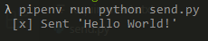
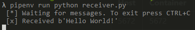

# Simple demonstration of RabbitMQ using Python and Docker

This is an application template which uses Python, RabbitMq, pipenv and Docker.

## What is RabbitMQ


RabbitMQ is the most widely deployed open source message broker.

RabbitMQ is lightweight and easy to deploy on premises and in the cloud. It supports multiple messaging protocols. RabbitMQ can be deployed in distributed and federated configurations to meet high-scale, high-availability requirements. 

_For more details check [RabbitMQ Page](https://www.rabbitmq.com/)._

## What is Docker


Docker is a tool designed to make it easier to create, deploy, and run applications by using containers. Containers allow a developer to package up an application with all of the parts it needs, such as libraries and other dependencies, and ship it all out as one package. By doing so, thanks to the container, the developer can rest assured that the application will run on any other Linux machine regardless of any customized settings that machine might have that could differ from the machine used for writing and testing the code.

_For more details check [Docker Hub](https://hub.docker.com/)_

## What is pipenv


Pipenv is a tool that aims to bring the best of all packaging worlds (bundler, composer, npm, cargo, yarn, etc.) to the Python world. Windows is a first-class citizen, in our world.

It automatically creates and manages a virtualenv for your projects, as well as adds/removes packages from your Pipfile as you install/uninstall packages. It also generates the ever-important Pipfile.lock, which is used to produce deterministic builds.

The problems that Pipenv seeks to solve are multi-faceted:

- You no longer need to use ```pip``` and ```virtualenv``` separately. They work together.

- Managing a ```requirements.txt``` file can be problematic, so Pipenv uses the upcoming ```Pipfile``` and ```Pipfile.lock``` instead, which is superior for basic use cases.

- Hashes are used everywhere, always. Security. Automatically expose security vulnerabilities.

- Give you insight into your dependency graph (e.g. ```$ pipenv graph```).

- Streamline development workflow by loading ```.env``` files.

_For more details check [pipenv on GitHub](https://github.com/pypa/pipenv)_

## How to use this template

### Prerequisites

- Python 3.9+

- pipenv installed

- Docker Engine 1.13.0+

- Docker Compose installed

### Installing requirements

To create the virtual environment and install all libraries and packages open the terminal in the root folder of this project (same place where the ```pipfile``` is) and type ```pipenv install```.

### Initialize RabbitMQ container

```docker-compose up -d```

This will download the RabbiMQ image from Docker Hub and start a container with the following ports mapped:

Host | Container | Description
-----|-----------|--------------
5672 | 5672      | Queue port
8080 | 15672     | Management port

### Sending and reading messages

1. Run ```send.py``` to send a message to a queue called **hello**.
    - _command ```pipenv run python send.py```_
    - 

2. Run ```receiver.py``` to read all the messages in the **hello** queue.
    - _command ```pipenv run python receiver.py```_
    - 
    